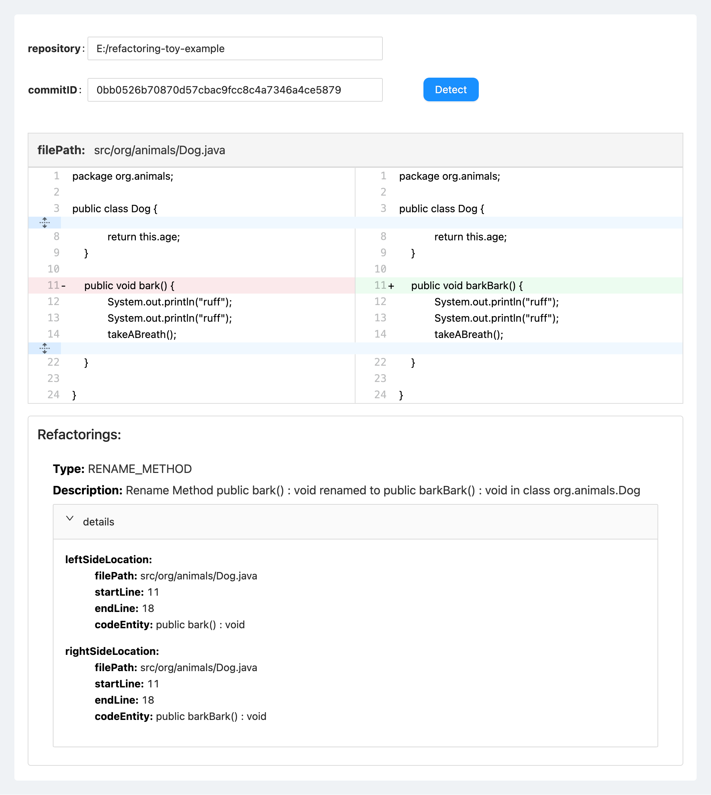

# Table of Contents

- [General Introduction](#general-introduction)
- [Contents of the Replication Package](#contents-of-the-replication-package)
- [Requirements](#requirements)
- [Data](#data)
- [How to Replicate the Evaluation](#how-to-replicate-the-evaluation)
- [Web](#web)

# General Introduction

This is the replication package for TSE2024 submission, containing both tool and data that are requested by the replication. It also provides detailed instructions to replicate the evaluation.

# Contents of the Replication Package

/data: Input of the evaluation as well as the outputs of the evaluation.

/tool: The implementation of the evaluated approaches (including the proposed approach and the baseline approach).

/web: The source code of the web application for refactoring visualization.

# Requirements

- Java 17.0.5 or newer
- Apache Maven 3.8.1 or newer

# Data

### 1. Scripts

Two scripts (**clone_projects.bat** and **clone_projects.sh**) that can downlow dataset from open-source projects, and the resulting dataset should be taken as the input of the evaluation.

### 2. Refactoring Discovery

All results reported by the proposed approach and the baseline approach as well as the labels manually validated by the refactoring experts, are available at the following links:

* [refactoring detection](data/refactoring%20detection/)

### 3. Entity Matching

All results reported by the proposed approach and the baseline approach as well as the labels manually validated by the experienced developers, are available at the following links:

* [entity matching](data/entity%20matching/)

# How to Replicate the Evaluation?

## IntelliJ IDEA

1. **Clone replicate package to your local file system**

   `git clone https://github.com/bitselab/ReExtractorPlus.git`

   

2. **Import project**

   Go to *File* -> *Open...*

   Browse to the **tool** directory of project ReExtractorPlus

   Click *OK*

   The project will be built automatically.

   

3. **Clone open-source project repositories (dataset)**

   `double-click clone_projects.bat` &emsp;&nbsp;(on windows environment)

   `./clone_projects.sh` &emsp;&emsp;&emsp;&emsp;&emsp;&emsp;&emsp;(on linux environment)

   

4. **Run the refactoring discovery experiment**

   Set `datasetPath` to the directory where the cloned dataset is located (line 18 in org.reextractorplus.experiment.RefactoringDetectionExperimentStarter.java)

   From the Project tab of IDEA navigate to `org.reextractorplus.experiment.RefactoringDetectionExperimentStarter`

   Right-click on the file and select *Run RefactoringDetectionExperimentStarter.main()*

   All results of refactoring discovery will be output to the console

   

   All results of refactoring discovery will be stored in the local file system in JSON format:

   `/data/refactoring detection/<project>.json` 

   

   # Web

   ### 1. Requirements

   - Java 17.0.5 or newer
   - Apache Maven 3.8.1 or newer
   - Node.js 20.17.0 or newer

   ### 2. Steps

   1. **Import BackEnd**

      Go to *File* -> *Open...*

      Browse to the **web/backend** directory of project ReExtractorPlus

      Click *OK*

   2. **Run BackEnd**

      From the Project tab of IDEA navigate to `org.reextractor.Application`

      Right-click on the file and select *Run Application.main()*

      The server will be run automatically.

   3. **Import FrontEnd**

      Go to *File* -> *Open Folder...*

      Browse to the **web/frontend** directory of project ReExtractorPlus

      Click *OK*

   4. **Run FrontEnd**

      Open New Terminate

      `npm i` 
      `npm run start` 

      Open your Browser and type `localhost:3001` 

   5. **Refactoring Detection**

      Type the repository and commit ID

      Click the *Detect* Button
      
      The identified refactorings will be display visually:

   
   
   

